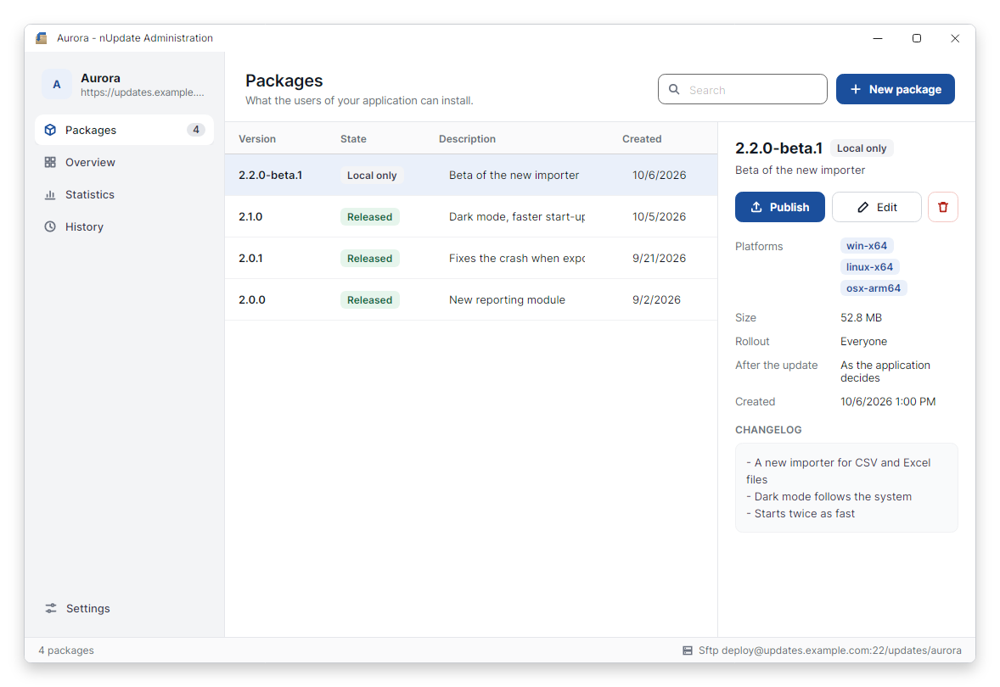
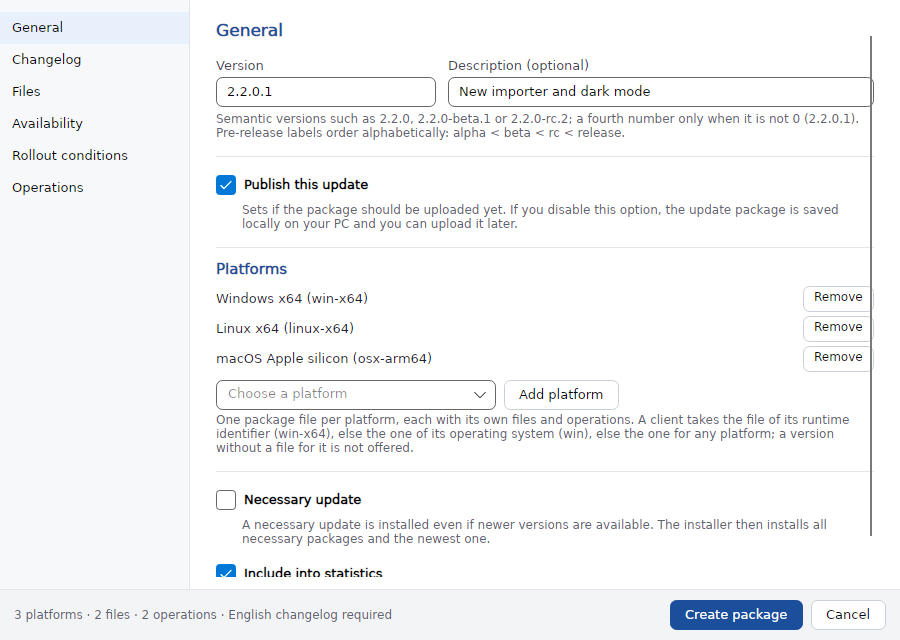
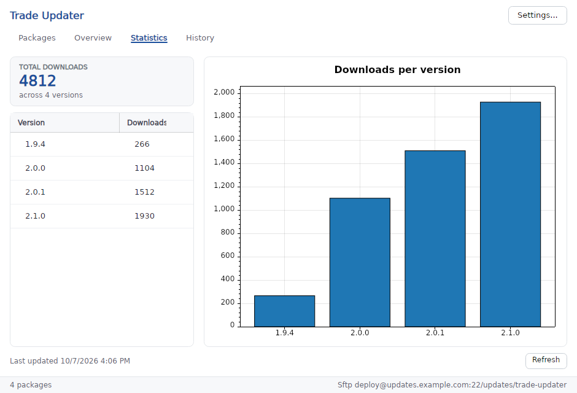
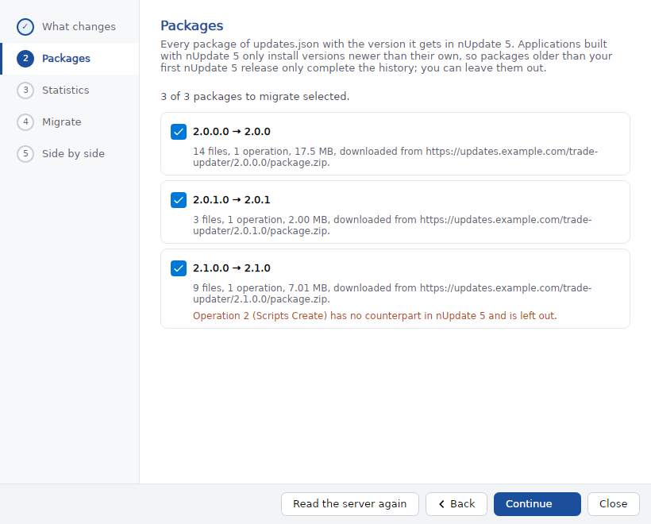
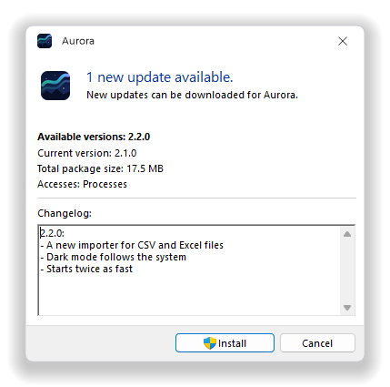
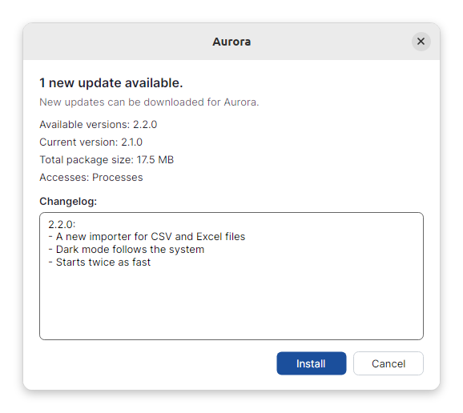
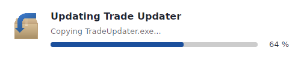
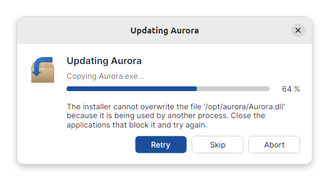

<div align="center">


# nUpdate

**Signed, self-hosted updates for .NET applications**

[](https://github.com/dbforge/nUpdate/actions/workflows/ci.yml) [](https://github.com/dbforge/nUpdate/releases) [](#requirements) [](LICENSE) [](https://www.paypal.com/cgi-bin/webscr?cmd=_donations&business=dominic%2ebeger%40hotmail%2ede&lc=DE&item_name=nUpdate&no_note=0&currency_code=EUR&bn=PP%2dDonationsBF%3abtn_donateCC_LG%2egif%3aNonHostedGuest)

[Features](#features) · [Installation](#installation) · [Usage](#usage) · [Examples](#examples) · [Migrating to 5.0](#migrating-to-50) · [Building](BUILDING.md)

</div>

nUpdate keeps your .NET application up to date from your own web server. You build, sign and publish update packages
with **nUpdate Administration**; the **nUpdate** library in your application finds them, downloads and verifies them and
hands them to the installer, with a ready-made user interface or one of your own.

<table>
  <tr>
    <td width="50%"></td>
    <td width="50%"></td>
  </tr>
  <tr>
    <td align="center"><sub>Packages of a project</sub></td>
    <td align="center"><sub>Creating an update package</sub></td>
  </tr>
  <tr>
    <td width="50%"></td>
    <td width="50%"></td>
  </tr>
  <tr>
    <td align="center"><sub>Download statistics</sub></td>
    <td align="center"><sub>Migration assistant for projects of nUpdate 4</sub></td>
  </tr>
</table>

## Features

**In your application**

- Task-based asynchronous API with cancellation and progress reporting
- Every package is checked against its size, SHA-512 hash and RSA-PSS signature (PEM keys) before it is installed
- Built-in update dialogs for Windows Forms, WPF and Avalonia, or your own user interface on top of the same update flow
- An installer for Windows, Linux and macOS that needs no .NET on the machine, with a small window or none at all,
  and replaces macOS application bundles as a whole
- One package file per platform, so a version can ship a Windows, a Linux and a macOS build side by side
- Pre-release channels, rollout conditions and necessary updates
- Operations during the installation: files and processes everywhere, registry and services on Windows
- Very large update packages

**In nUpdate Administration**

- Runs on Windows, Linux and macOS, in light or dark mode as the system is set; on macOS as an app with its own menus
- A project is a folder you can copy to any machine
- Published packages stay editable: change their files, operations and platforms, and nUpdate Administration builds
  the changed platforms again, signs them and replaces them on the server
- Publishing over SFTP, FTPS and FTP, or through your own transfer plugin
- Secrets encrypted with a project password, server certificates and host keys trusted by fingerprint
- Download statistics through a small PHP/MySQL endpoint
- A migration assistant that moves projects of nUpdate 3 and 4 over while both versions keep running

## Requirements

| Component | Runs on |
| --- | --- |
| `nUpdate` library | .NET Standard 2.0: .NET Framework 4.6.2 and later, .NET 6 and later |
| Built-in installer (`nUpdate.UpdateInstaller.UI.Avalonia`) | Self-contained, nothing to install: win-x64, win-x86, win-arm64, linux-x64, linux-arm64, osx-x64, osx-arm64 |
| `nUpdate.UpdateInstaller`, the base for an installer of your own | .NET Standard 2.0 |
| `nUpdate.UI.WindowsForms`, `nUpdate.UI.WPF` | .NET Framework 4.6.2 and .NET 8 on Windows |
| `nUpdate.UI.Avalonia` | .NET 8 on Windows, Linux and macOS, in an application on Avalonia 12 with the Fluent theme |
| nUpdate Administration | .NET 10 on Windows, Linux and macOS |
| Update server | Any web server for the files; PHP 7.1+ with mysqli and MySQL for the optional statistics |

## Installation

nUpdate 5 is a release candidate: 5.0.0-rc.1 is complete and tested, but details may still change before 5.0.0.

```
dotnet add package nUpdate --version 5.0.0-rc.1
dotnet add package nUpdate.UpdateInstaller.UI.Avalonia --version 5.0.0-rc.1
```

`nUpdate.UpdateInstaller.UI.Avalonia` carries the built-in installer for seven runtime identifiers. On build it copies
the one of your application's `RuntimeIdentifier` to `nUpdate.Installer/<rid>/` next to your application, which is
where `UpdateManager` looks for it. Ship that folder with your application. A project without a runtime identifier
(a framework-dependent build, or .NET Framework) gets all seven, about 170 MB, and warning `NUPD001`; name the ones you
ship instead:

``` xml
<PropertyGroup>
  <nUpdateInstallerRuntimes>win-x64;win-arm64</nUpdateInstallerRuntimes>
</PropertyGroup>
```

nUpdate Administration is available from the [releases](https://github.com/dbforge/nUpdate/releases).

## Usage

### 1. Declare the version of your application

``` c#
[assembly: ApplicationVersion("1.0.0")]
```

You can also pass the version to the `UpdateManager` constructor (`currentVersion`); the constructor argument wins when
both are present.

### 2. Create the `UpdateManager`

``` c#
var manager = new UpdateManager(new Uri("https://example.com/updates/nupdate.json"), publicKey,
    CultureInfo.CurrentUICulture);
```

`publicKey` is the PEM public key of your project, and `nupdate.json` is the feed nUpdate Administration writes next to
the `packages/` folder. The administration generates this snippet for your project (Overview > Copy source).

The installer updates the folder of the running executable and starts it again; `UpdateManager` takes its path from
the process, single-file builds included. Where that fails, for example in a host that runs your code in another
process, set `ApplicationExecutablePath` to the absolute path of the executable, such as `Environment.ProcessPath`.

### 3. Update, with the integrated user interface…

```
dotnet add package nUpdate.UI.WindowsForms --version 5.0.0-rc.1
dotnet add package nUpdate.UI.WPF --version 5.0.0-rc.1
dotnet add package nUpdate.UI.Avalonia --version 5.0.0-rc.1
```

Each package provides an `UpdaterUI` class. Create and use it on the UI thread:

``` c#
var updaterUI = new UpdaterUI(manager, this); // the owning form or window is optional
updaterUI.UseHiddenSearch = true;             // say nothing when the application is up to date
var result = await updaterUI.RunAsync();
```

The user interfaces are thin presenters over `nUpdate.Ui.UpdateFlow`, which you can also drive with your own dialogs by
implementing `IUpdateFlowPresenter`.

<p align="center">
  
  
</p>

### …or without one

``` c#
if (await manager.CheckForUpdatesAsync())
{
    await manager.DownloadAsync(progress, cancellationToken);
    if (await manager.VerifyAsync())
        manager.StartInstaller();
}
```

### How the client behaves

- **Asynchronous:** every operation accepts a `CancellationToken`; `DownloadAsync` reports `UpdateDownloadProgress`.
- **Checked:** `DownloadAsync` compares the size and SHA-512 hash of every package with the feed, and `VerifyAsync`
  checks the RSA-PSS signatures and that each package's manifest names your project and its version.
- **Timeouts:** `HttpTimeout` (100 seconds by default) bounds every request, and a server that stops responding
  surfaces as an `HttpRequestException`, not as a cancellation. On .NET Framework the timeout covers the headers of a
  download but not the bytes of the package, so pass a `CancellationToken` if a stalled download must be stopped.
- **Pre-releases:** `MinimumStability` (`Release`, `ReleaseCandidate`, `Beta` or `Any`) is the least stable version a
  client installs, each level including the more stable ones, and `AcceptedPreReleaseLabels` adds custom labels. The
  default `Release` installs releases only, so release candidates are skipped unless the client asks for them
  (nUpdate 3 and 4 always offered them).
- **Rollout and installation:** `RolloutConditions` are matched against the rollout conditions of a package, and
  `DefaultAfterInstall` tells the installer whether to restart, close or keep the application running. A package can
  ask to restart the application or to leave it closed instead (set in nUpdate Administration); when several packages
  are installed together, leaving it closed wins. `AfterInstall` is the outcome for the updates found, and the update
  dialogs say when the application stays closed.
- **Statistics:** failures never abort the download; they are written to `UpdateManagerServices.Logger` (an `ILogger`).

### The installer

<p align="center">
  
  
</p>

`StartInstaller()` copies the installer to a temp folder, writes its options next to it, starts it and closes your
application (unless `AfterInstall` is `KeepRunning`). The installer waits for the application to exit, runs the
operations of every package, copies its files, restarts the application and deletes the downloads.

- **A window or none:** the installer shows a small window with the progress, asks what to do with a file another
  process holds open and shows errors. Without a display (a Windows service, a Linux server without `DISPLAY` or
  `WAYLAND_DISPLAY`), or when the window cannot open, it installs without one; `ShowInstallerWindow = false` asks
  for that. `InstallerIcon` (a PNG) and `InstallerAccentColor` (`#RRGGBB`, also used by the `nUpdate.UI.Avalonia`
  dialogs) brand the window, which follows the system's light or dark mode. When the installer cannot even start,
  for example because the options do not match its version, it says so in the window too.
- **The log:** every run writes `install.log` into the installer's temp folder
  (`<temp>/nUpdate Installer/<application>`, or a folder next to it with a suffix while an earlier installer or a virus
  scanner still holds a file in it); error messages name it, and on Windows failures of a windowless run also go to the
  event log.
- **Rights:** on Windows the installer asks for administrator rights through UAC unless `RunInstallerAsAdmin` is
  `false`. Linux and macOS have no such prompt: the installer runs as the user, and `StartInstaller()` throws an
  `UnauthorizedAccessException` with a translated message when that user may not change the application's folder.
- **Platforms:** nUpdate Administration builds one package file per platform: `any`, an operating system (`win`,
  `linux`, `osx`) or a runtime identifier (`win-x64`, `linux-arm64`, `osx-arm64`, ...). A client takes the file of its
  runtime identifier, else the one of its operating system, else the one for any platform, and does not see versions
  without a file for it. `UpdateManager.Platform` is the process's runtime identifier. Publish an AnyCPU build, which
  runs as a 64-bit process on some machines and as a 32-bit one on others, for `win`. Registry and service operations
  exist only on Windows.
- **Your own installer:** set `InstallerPath` to an installer of your own (see the [example](#examples)); give it a
  folder of its own, since that whole folder is copied.

#### macOS application bundles

When the application runs from a bundle (`MyApp.app/Contents/MacOS/MyApp`), `Program` and `%program%` mean the whole
bundle. Add the signed `.app` folder to `Program` on a macOS platform in nUpdate Administration; the installer builds
the new bundle next to the installed one as `MyApp.app.new`, swaps the two in one step and deletes the old one, so the
signature of what you shipped stays intact. Packages cannot contain symbolic links, so a bundle with embedded
frameworks (`Versions/Current`) has to be flattened first. The built-in installer for `osx-x64` and `osx-arm64` is
signed ad hoc. When
you sign and notarize your application, sign the installer as part of the bundle:

```
codesign --force --options runtime --timestamp --entitlements installer.entitlements \
  --sign "Developer ID Application: …" \
  MyApp.app/Contents/MacOS/nUpdate.Installer/osx-arm64/nUpdate.UpdateInstaller.UI.Avalonia
codesign --force --options runtime --timestamp --sign "Developer ID Application: …" MyApp.app
xcrun notarytool submit MyApp.zip --keychain-profile "notary" --wait
```

Under the hardened runtime a .NET application needs the JIT entitlement, and the installer loads its native libraries
(Skia, HarfBuzz) from where the single file extracts them, which library validation would refuse. `installer.entitlements`:

``` xml
<?xml version="1.0" encoding="UTF-8"?>
<!DOCTYPE plist PUBLIC "-//Apple//DTD PLIST 1.0//EN" "http://www.apple.com/DTDs/PropertyList-1.0.dtd">
<plist version="1.0">
<dict>
  <key>com.apple.security.cs.allow-jit</key><true/>
  <key>com.apple.security.cs.disable-library-validation</key><true/>
</dict>
</plist>
```

### Customising the environment

`UpdateManager` takes an optional `UpdateManagerServices` with the `HttpClient`, file system
(`System.IO.Abstractions`, which the package depends on), process launcher, file permissions, system and application
information and the `IApplicationTerminator` that closes the host before the installer runs. Replace them to integrate with your own
hosting model or to test your update code without touching the network or the disk.

### Versions

Versions follow semantic versioning with an optional fourth number:

| Form | Example |
| --- | --- |
| Release | `2.1.0` |
| With a fourth number (only when it is not 0) | `2.1.0.4` |
| Pre-release | `1.2.0-beta.1`, `2.0.0-rc.2`, `1.5.0-preview.3` |
| Build metadata (ignored for ordering) | `1.2.0-beta.1+build.7` |

This canonical spelling is what `ToString()` returns and the only one that parses, so every version has exactly one
form in the feed, the manifests, the project files and the administration. `1.2`, `1.2.0.0` and the classic `1.2b1` of
nUpdate 3 and 4 are rejected with a message that shows the expected form; nUpdate Administration converts them when it
migrates a project (`1.2.0.0b1` becomes `1.2.0-beta.1`). Labels order like SemVer identifiers (numbers before words,
words alphabetically, a shorter label first), so `alpha` < `beta` < `rc` < release.

## Examples

Each example assumes a `manager` created as in [Usage](#usage). They compile against the `nUpdate` package as shown.

<details>
<summary><b>Check quietly on start-up and only speak up when there is something new</b></summary>

``` c#
// Windows Forms: in the Shown event of the main form. WPF works the same with the window as owner.
var updaterUI = new UpdaterUI(manager, this) { UseHiddenSearch = true };
var result = await updaterUI.RunAsync();
// NoUpdates and Failed searches stay silent with UseHiddenSearch; InstallerStarted closes the application.
```

Call it again from a timer (every few hours, for example) for applications that run for days.

</details>

<details>
<summary><b>Update a console or headless application with progress output</b></summary>

``` c#
using var manager = new UpdateManager(new Uri("https://example.com/updates/nupdate.json"), publicKey);
if (!await manager.CheckForUpdatesAsync())
{
    Console.WriteLine("You are up to date.");
    return;
}

Console.WriteLine($"{manager.AvailableUpdates.Count} update(s), {manager.TotalDownloadSize / 1024.0 / 1024.0:0.0} MB");
var progress = new Progress<UpdateDownloadProgress>(p => Console.Write($"\rDownloading... {p.Percentage:0}%"));
await manager.DownloadAsync(progress);
Console.WriteLine();
if (!await manager.VerifyAsync())
{
    Console.WriteLine("A package does not carry a valid signature and was deleted.");
    return;
}

manager.StartInstaller(); // closes this application unless AfterInstall is KeepRunning
```

</details>

<details>
<summary><b>Show what is new before downloading</b></summary>

``` c#
if (await manager.CheckForUpdatesAsync())
{
    foreach (var package in manager.AvailableUpdates)
    {
        Console.WriteLine($"{package.Version} from {package.PublishedAt:d}{(package.Necessary ? " (required)" : "")}");
        Console.WriteLine(package.GetChangelog(CultureInfo.CurrentUICulture)); // falls back to English
    }
}
```

</details>

<details>
<summary><b>Offer betas to some users and roll out in stages</b></summary>

``` c#
// Pre-releases: Release (default), ReleaseCandidate, Beta or Any; Beta also installs release candidates and releases.
manager.MinimumStability = settings.WantsBetas ? Stability.Beta : Stability.Release;
manager.AcceptedPreReleaseLabels.Add("nightly"); // also offer 2.1.0-nightly.7 to this client

// Rollout conditions: a package with conditions (set in nUpdate Administration) is only offered to clients whose
// values match them, so you can ship to one region or ring first.
manager.RolloutConditions["Region"] = "EU";
manager.RolloutConditions["Ring"] = "early-adopters";
```

</details>

<details>
<summary><b>Restart with arguments and react to a finished update</b></summary>

``` c#
manager.DefaultAfterInstall = AfterInstall.Restart; // or Close to leave it closed, or KeepRunning; a package can override it
manager.Arguments.Add(new InstallerArgument("--updated", ArgumentCondition.Succeeded));
manager.Arguments.Add(new InstallerArgument("--update-failed", ArgumentCondition.Failed));

// Restarted from the installer, not from a shortcut: pass on the arguments this instance was started with,
// such as a settings file, so the updated application gets them too.
foreach (var argument in Environment.GetCommandLineArgs().Skip(1))
    manager.Arguments.Add(new InstallerArgument(argument));

// In Main of the restarted application:
if (args.Contains("--updated"))
    ShowWhatsNew();
```

</details>

<details>
<summary><b>Proxy, HTTP authentication, timeouts and cancellation</b></summary>

``` c#
// Set these before the first check: they are applied when the HTTP client is created.
manager.Proxy = new WebProxy("http://proxy.example.com:8080") { Credentials = CredentialCache.DefaultCredentials };
manager.HttpAuthenticationCredentials = new NetworkCredential("updates", "secret");
manager.HttpTimeout = TimeSpan.FromSeconds(30);

using var cancellation = new CancellationTokenSource(TimeSpan.FromMinutes(10));
if (await manager.CheckForUpdatesAsync(cancellation.Token))
    await manager.DownloadAsync(progress, cancellation.Token);
```

</details>

<details>
<summary><b>Log what nUpdate does</b></summary>

``` c#
// Any Microsoft.Extensions.Logging logger; statistics failures and unreadable files are reported here.
using var loggerFactory = LoggerFactory.Create(builder => builder.AddConsole());
var services = new UpdateManagerServices { Logger = loggerFactory.CreateLogger("nUpdate") };
using var manager = new UpdateManager(new Uri("https://example.com/updates/nupdate.json"), publicKey, services: services);
```

</details>

<details>
<summary><b>Your own update dialogs</b></summary>

`UpdateFlow` runs search, confirmation, download, verification and installer start; you only present each step.

``` c#
sealed class ConsolePresenter : IUpdateFlowPresenter
{
    public Task<bool> RunSearchAsync(Func<CancellationToken, Task<bool>> search) => search(CancellationToken.None);

    public Task ShowNoUpdatesAsync()
    {
        Console.WriteLine("You are up to date.");
        return Task.CompletedTask;
    }

    public Task<bool> ConfirmInstallAsync()
    {
        Console.Write("Install the updates now? [y/N] ");
        return Task.FromResult(Console.ReadLine()?.Trim() == "y");
    }

    public Task RunDownloadAsync(Func<IProgress<UpdateDownloadProgress>, CancellationToken, Task> download) =>
        download(new Progress<UpdateDownloadProgress>(p => Console.Write($"\r{p.Percentage:0}%")), CancellationToken.None);

    public Task ShowErrorAsync(UpdateErrorMessage message, Exception? exception)
    {
        Console.Error.WriteLine($"{message.Caption}: {message.Text}");
        return Task.CompletedTask;
    }
}

var result = await new UpdateFlow(manager, new ConsolePresenter()).RunAsync();
```

</details>

<details>
<summary><b>Your own installer</b></summary>

An installer of your own is a small executable on the `nUpdate.UpdateInstaller` package. `InstallerHost` does the
work (options, waiting for the application, files, operations, restart, `install.log`, the windowless mode); you
provide the window by deriving from `WindowProgressReporter`, which takes care of the threads.
[`samples/CustomInstaller`](samples/CustomInstaller) is a complete WPF example.

``` c#
// The installer's Program.cs
[STAThread]
static int Main(string[] args) => InstallerHost.Run(args, session => new MyProgressWindow(session));

// In the application: the installer for this platform, in a folder of its own.
manager.InstallerPath = OperatingSystem.IsWindows()
    ? Path.Combine(AppContext.BaseDirectory, "MyInstaller", "MyInstaller.exe")
    : Path.Combine(AppContext.BaseDirectory, "MyInstaller", "MyInstaller");
```

</details>

<details>
<summary><b>Install without a window, and brand the one you show</b></summary>

``` c#
// A tray tool or a service: no window, the log tells what happened.
manager.ShowInstallerWindow = false;

// Otherwise the built-in window can carry your icon and colour.
manager.InstallerIcon = Path.Combine(AppContext.BaseDirectory, "Assets", "app-256.png");
manager.InstallerAccentColor = "#2E7D32";
```

</details>

<details>
<summary><b>Another language</b></summary>

Copy [`en.json`](nUpdate/Localization/en.json), translate it and register it. English, German (Germany, Austria,
Switzerland), Spanish, Italian and Chinese (simplified) are built in.

``` c#
manager.TextFiles[new CultureInfo("fr-FR")] = Path.Combine(AppContext.BaseDirectory, "Localization", "fr-FR.json");
manager.Culture = new CultureInfo("fr-FR");
```

</details>

<details>
<summary><b>Test your update code without network, disk or restarts</b></summary>

``` c#
var services = new UpdateManagerServices
{
    HttpClient = new HttpClient(fakeHandler),   // serves nupdate.json and packages from memory
    FileSystem = new MockFileSystem(),          // System.IO.Abstractions.TestingHelpers
    ProcessLauncher = fakeLauncher,             // records the installer start instead of running it
    ApplicationTerminator = fakeTerminator,     // keeps the test process alive
};
using var manager = new UpdateManager(feedUri, publicKey, currentVersion: new UpdateVersion("1.0.0"), services: services);
```

</details>

## Migrating to 5.0

Version 5.0 is a breaking release with new file formats; every document carries an integer `format` field. Open a
project of nUpdate 3 or 4 in nUpdate Administration 5: it converts the project file, and the migration assistant
publishes the packages for nUpdate 5 next to the old ones, so installations of both versions keep finding their
updates.

### Running nUpdate 4 and nUpdate 5 side by side

Installed copies of your application keep their nUpdate 4 until they update, and nUpdate 4 only reads `updates.json`.
The migration assistant ends with these steps:

1. **Check the new feed.** The assistant downloads `nupdate.json` and every package the way a 5.0 client does, checks
   size, hash, signature and manifest, and asks the statistics API whether it answers.
2. **Build your application with nUpdate 5.** Update the packages, create the `UpdateManager` with the new feed and the
   PEM public key (Overview > Copy source) and declare the version of that build in the canonical form,
   `[assembly: ApplicationVersion("1.3.0")]`. It must be higher than everything in `updates.json`: a version the
   installed copies already have would offer itself as an update again and again.
3. **Ship that build once through the old feed.** Publish it with nUpdate Administration 4 under the same version
   written the old way (`1.3.0.0`), so installed copies update to it and read `nupdate.json` from then on. Publish the
   same version with nUpdate Administration 5 as well, and every later version only there.
4. **Keep the old files until everybody has moved.** `updates.json`, the version folders and `statistics.php` stay on
   the server. nUpdate Administration 4 keeps working next to version 5: it keeps its project file, `projconf.json` and
   package copies, while version 5 uses `projects.json`, `nupdate.json` and `nupdate-statistics.php`. Open the projects
   of version 5 from nUpdate Administration 5; double-clicking a `.nupdproj` file starts whichever version registered
   the extension, usually version 4.
5. **Retire the nUpdate 4 setup** from the Overview tab once nobody downloads from `updates.json`. It lists, then
   deletes the version folders, `statistics.php` and finally `updates.json` on the server, and the version folders with
   this project's package copies that nUpdate Administration 4 and the 5.0 pre-releases kept on your computer.

<details>
<summary><b>Everything that changed in detail</b></summary>

- **Projects are folders**: a project is `project.nupdproj` plus a `packages/` folder next to it. Copy the folder to
  another computer and open the project file there; the export and import feature is gone. The wizard asks where to
  put the folder (`Documents/nUpdate Projects/<name>` by default). Secrets (passwords, the private key) are stored in
  the project file encrypted with a project password (PBKDF2-SHA256 and AES-GCM); the password is remembered per user
  and machine and asked for once elsewhere. You can also keep the secrets out of the file and enter them when the
  project is opened.
- **Projects of earlier versions are converted when you open them**: files written by every nUpdate Administration
  since 1.0 (the files before 1.0 Beta 2, `1b2`, `3b2`, `v3`) and by the 5.0 pre-releases (`v5`). The converted
  project is saved as `<project name>/project.nupdproj` next to the old file (in the old folder when it is named after
  the project, and in `Documents/nUpdate Projects/<name>` when the old file lies in the data folder of nUpdate
  Administration 4). The old file is never overwritten, so nUpdate Administration 4 can keep using it. The RSA keys are
  converted from XML to PEM, the same key pair signs on, and the versions are converted to the canonical form.
- **Published packages are migrated with the migration assistant**: the server layout changed from `updates.json`
  plus `<version>/<id>.zip` to `nupdate.json` plus `packages/<version>/<platform>.zip`; every package file carries a
  `manifest.json` with its platform and operations and is signed with RSA-PSS. Packages for x86, x64 and any
  architecture become `win-x86`, `win-x64` and `win`, since nUpdate 3 and 4 only ran on Windows. When you open a converted project whose server still has only
  `updates.json`, the migration assistant opens. It shows what is on the server and what the migration adds and keeps,
  lists every package with its new version and with what cannot be carried over (operations without a counterpart such
  as C# scripts,
  files outside the known folders, a zip whose nUpdate 4 signature does not match), checks the statistics settings,
  then repacks, re-signs and uploads the selected packages and writes `nupdate.json`. Only zips that carry the
  signature `updates.json` names for them are signed anew. Nothing of nUpdate 3 and 4 is changed, so both versions run side by side (see
  below). Nothing can be published until the migration ran; the assistant is also on the Overview tab and in the
  settings.
- **Client API**: `CheckForUpdatesAsync`, `DownloadAsync`, `VerifyAsync`, `StartInstaller()` and `DeleteDownloads()`
  replace `SearchForUpdatesAsync`, `DownloadPackagesAsync`, `ValidatePackagesAsync`, `InstallPackage()` and
  `DeletePackages()`; `AvailableUpdates` (a list of `PackageInfo` from the `UpdateFeed`) replaces
  `PackageConfigurations`, `FeedUri` replaces `UpdateConfigurationFileUri`, `TotalDownloadSize`, `DownloadedPackages`
  and `DownloadDirectory` replace `TotalSize`, `PackageFilePaths` and `UpdateDirectory`. `DefaultAfterInstall`
  (`Restart`, `Close`, `KeepRunning`) replaces `HostApplicationOptions`, and a package can override it;
  `InstallerArgument(value, when)` with `ArgumentCondition` (`Succeeded`, `Failed`, `Always`) replaces
  `UpdateArgument`; `MinimumStability` and `AcceptedPreReleaseLabels` replace `IncludeAlpha` and `IncludeBeta`; `Culture`, `Texts` and `TextFiles` replace `LanguageCulture`,
  `LocalizationProperties` and `CultureFilePaths`; `ReportDownloads` replaces `IncludeCurrentPcIntoStatistics`;
  `RolloutConditions` replaces `Conditions`, with `RolloutCondition.Negated` and `RolloutConditionMode.Any`;
  `Platform` and the platform of each package file replace `Architecture`; `UpdateManagerServices.Logger` replaces the
  `StatisticsReportFailed` event; `UseDynamicUpdateUri` is gone because the `path` of a package file in the feed is
  relative to the feed unless it is absolute;
  `ApplicationVersionAttribute` replaces `nUpdateVersionAttribute`; `UpdaterUI.RunAsync()` replaces
  `ShowUserInterfaceAsync()`. `UpdateVersion` lost `FullText`, `SemanticVersion`, `FromFullText` and
  `DevelopmentBuild`; `BasicVersion` became `Release`, and `ToString()` is the only string form and the only one that
  parses: write `[assembly: ApplicationVersion("1.2.0-beta.1")]` where nUpdate 4 had
  `[assembly: nUpdateVersion("1.2.0.0b1")]`.
- **Installer deployment**: the installer is no longer embedded in `nUpdate.dll` and no longer needs .NET Framework.
  Install the `nUpdate.UpdateInstaller.UI.Avalonia` package and ship the `nUpdate.Installer` folder, or set
  `InstallerPath` to an installer of your own built on `nUpdate.UpdateInstaller` (custom user interface assemblies and
  `CustomUiAssemblyPath` are gone). The installer reads one JSON options file (`format` 2) and the `manifest.json` of
  every package. Operations are typed (`deleteFiles`, `renameFile`, `setRegistryValues` with typed registry values,
  `startProcess`, which can wait for the process and fail on an error exit code, ...); the C# script operation is gone.
- **Statistics**: a REST API v2 below `nupdate-statistics.php` (`GET /v2`, `POST /v2/downloads`,
  `GET /v2/projects/{id}/statistics`, `PUT|DELETE /v2/projects/{id}/versions/{version}`, `DELETE /v2/projects/{id}`),
  bearer-authenticated for everything but the download report, with JSON errors. The script and its configuration
  (`nupdate-statistics.config.php`, uploaded without being kept locally) are generated per project and need PHP 7.1
  or later with mysqli; the tables (`nupdate_version`, `nupdate_download`) are created on first use, and only downloads
  of versions the administration registered are counted. The names differ from the `statistics.php` and the tables of
  nUpdate 3 and 4, so both versions report into the same database side by side. There is no compatibility with the
  earlier endpoints and old statistics are not migrated.
- **Administration**: rewritten with Avalonia for Windows, Linux and macOS. Transfer over SFTP (the default for new
  projects), FTPS and FTP is built in (SSH.NET and FluentFTP), the project proxy applies to all of them, and third-party
  transfer plugins implement the asynchronous `ITransferProvider`; the Starksoft libraries and the IPv4/IPv6 preference
  are gone. Server certificates and SSH host keys must be trusted explicitly by fingerprint. FTPS cannot resume the TLS
  session of the control connection on data connections, which vsftpd and ProFTPD require by default; allow fresh
  sessions on the server (`require_ssl_reuse=NO`, `TLSOptions NoSessionReuseRequired`) or use SFTP, as the error message
  suggests. Renaming a project changes its name only; the folder stays. The data folder (`nUpdate Administration` in the
  roaming application data) only holds the list of known projects (`projects.json`) and the remembered project
  passwords. nUpdate Administration 4 uses the same folder: its `projconf.json` is read until the new list exists and
  never changed, and its local package copies are left alone, so both versions can be installed side by side. The
  remembered passwords are protected with DPAPI on Windows, and on Linux and macOS with a key ring in that folder, so
  they are only as private as the folder itself. Editing the files of an already created package, the server directory
  browser and cancelling a running upload are not available in this version.
- **Timeouts and cleanup**: the search timeout grew from 10 to 100 seconds (`HttpTimeout`, replacing `SearchTimeout`);
  the installer is copied to one fixed temp folder per application and old downloads are removed before a new one.
  Overriding `TerminateApplication` is replaced by `UpdateManagerServices.ApplicationTerminator`.

</details>

## Building and contributing

[BUILDING.md](BUILDING.md) explains how to build, test and check the coverage gate. Every push runs the
[CI workflow](.github/workflows/ci.yml): formatting, the full test suite including the Docker integration tests and
the headless UI scenarios on Linux; the NuGet packages with the installers for all seven runtime identifiers; the
Windows-only tests and a build of nUpdate Administration on Windows; and a real update with the published installer
on Linux, Windows and macOS, including the swap of a signed application bundle.

## Supported by

<a href="https://www.jetbrains.com/"></a>

## License

nUpdate is released under the [MIT license](LICENSE).
